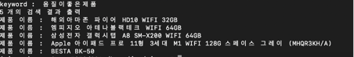

## KorSimCSE_NLP

이 repository는 [SimCSE: Simple Contrastive Learning of Sentence Embeddings](https://arxiv.org/abs/2104.08821) 에서 소개된 모델인 SimCSE를 한국어 데이터셋을 사용하여 학습시킨 모델이다.

더불어 supervised SimCSE를 사용하여 간단한 데모를 구현하였다.

본 코드는 [SimCSE github](https://github.com/princeton-nlp/SimCSE) 를 기반으로 작성되었습니다. 

## Quick Links

  - [SimCSE란?](#what_is_simcse)
  - [데이터 셋(Dataset)](#dataset)
  - [학습 결과](#result)
  - [Environment Setting](#use-simcse-with-huggingface)
  - [Train](#citation)
  - [Demo : 쇼핑몰 리뷰 기반 검색 시스템](#demo)

## SimCSE란?

SimCSE란 contrastive learning을 사용하여 sentence embedding의 성능을 대폭 향상시킨 모델이다.
SimCSE에서는 unsupervised approach, supervised approach 두 가지 방법을 제공한다. 
Unsupervised SimCSE는 positive sentence pair의 부족을 dropout으로 보완하였으며, Supervised approach에서는 NLI dataset 내에서 entailment를 positive, contradiction을 negative로 labeling하여 성능을 개선하였다.

본 repository에서는 이러한 원리의 SimCSE를 한국어 데이터셋을 가지고 fine-tuning하였다.
Supervised SimCSE의 학습에는 [KorNLI](https://github.com/kakaobrain/KorNLUDatasets) 를 사용하였으며 Unsupervised SimCSE의 학습에는 [AI Hub](https://aihub.or.kr/aihub-data/natural-language/about) 에서 제공하는 기계독해 데이터셋을 사용하였다.
두 모델의 평가에는 [KorSTS](https://github.com/kakaobrain/KorNLUDatasets) 를 사용하였다.

학습 기반 모델로는 `BERT-base`를 사용하였다.

## 데이터 셋(DatasetI
* Unsupervised SimCSE : AI Hub에서 제공하는 기계독해 데이터 셋 내의 지문을 문장 단위로 잘라서 txt파일로 저장하였다. 약 1,000,005개의 문장을 사용하였다.
* Supervised SimCSE : KorNLI 데이터 셋 내에서 entailment, contradiction을 +/-로 labeling하여 사용하였다. 

데이터 셋은 `data` 폴더에서 찾을 수 있다. 

## 학습 결과

Supervised SimCSE의 경우 3 epoch, Unsupervised SimCSE의 경우 1 epoch만큼 학습을 진행하였다. 

KorSTS 데이터셋에 대해 Spearman correlation을 측정하였으며 결과는 아래와 같다.

| Model                 | Spearman's Correlation |
|:----------------------|:----------------------:|
| Supervised SimCSE     |         0.830          |
| Unsupervised SimCSE   |         0.730          |

## Environment Setting

 `requriements.txt` 속 라이브러리와 추가로 아래의 라이브러리를 사용하여 실험을 진행하였다.

| Module       | Version |
|:-------------|:-------:|
| faiss-cpu    |  1.7.2  ||
| tqdm         | 4.49.0  |


## Train
Supervised SimCSE의 경우 아래와 같이 학습하면 된다.
```bash
sh run_sup_example.sh
```

Unsupervised SimCSE의 경우 아래와 같이 학습하면 된다.
```bash
sh run_unsup_example.sh
```

## Demo : 쇼핑몰 리뷰 기반 검색 시스템

**문제 상황**
* Pre-trained LM을 사용하여 제품 이름에 대한 임베딩을 얻는 것은 매우 어렵다. 사실 제품 이름으로 부터 semantic 의미를 찾는 것은 인간도 하지 못할뿐더라 딱히 semantic 의미도 없다. 예를 들어 ‘갤럭시 s22’라는 단어를 보고 핸드폰이라고 생각할 수 있는 것은 단어에 담긴 의미로부터 유추되는 것이 아니라 이미 갤럭시가 핸드폰 관련 용어임을 알기 때문이라고 할 수 있다. 
* 제품 이름에 대한 임베딩을 얻기 위해 각 제품 이름이 어떠한 것을 의미하는 지 따로 명시 해주어야 한다. 하지만 이러한 작업은 time-consuming하다. 따라서 다음과 같은 아이디어를 생각하게 되었다.

**아이디어**
* 일단 각 상품의 괜찮은 리뷰들을 SimCSE를 사용하여 sentence embeddings를 얻는다.
* 각 제품 이름의 임베딩 값은 리뷰 임베딩들의 평균으로 한다. 
  * 이때 각 리뷰는 `[CLS] 제품 이름 [SEP] 리뷰 [SEP]` 형식으로 인코딩 된다.
* SimCSE는 embedding space에서 alignment와 uniformity를 모두 만족하게끔 학습이 되어있으므로 각 리뷰들은 space에 고루고루 퍼질 것이고 따라서 각 제품에 대해 여러 cluster이 존재하는 분포를 가지게 된다.
* 검색어(query)가 들어오면 -> 인코딩 -> projected space에서 검색 (faiss)-> 가장 가까이 있는 k개의 상품 출력

**데이터**
* 태블릿 상품 18개에 대한 리뷰들 
* 노트북 상품 27개에 대한 리뷰들

**코드 설명**
 `inference.py`에 KorNLI dataset으로 학습된 supervised SimCSE로 해당 알고리즘을 구현하였다.

각 함수의 역할은 아래와 같다.
* `make_index`: argeparse 인자로 받은 해당 category에 맞는 review파일을 읽어 index를 만들고 저장한다.
* `load_index`: 인자로 받은 경로의 인덱스 파일을 load한다..
* `view_product`: 현재 index에 저장되어있는 상품들을 보여준다.
* `keyword_search`: argparse 인자로 받은 keyword를 가지고 주어진 index에 대해 검색을 한다. 이때 top 5개의 결과만을 가져오게 하였다.

**실행 방법**

`python inference.py –category 카테고리 –keyword 검색어`

**실행 결과**


